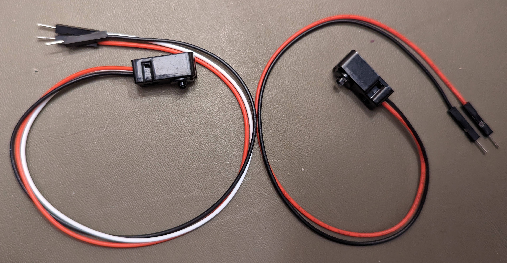

# Break-Beam Sensor

A break-beam sensor (or "electric eye", or "garage door sensor") has an LED
that emits light of a specific frequency (color), and a receiver (usually a
phototransistor) that responds to that same frequency.  If the LED is pointed
at the receiver and there is nothing in the path between them, the receiver
activates.  If the LED's light is blocked, the receiver doesn't activate.  We
can use this to detect whether a linear path ("beam") is blocked or obscured
("broken").

# What does a break-beam sensor look like?

Here's one type of break-beam sensor that we use:

Note that the emitter only needs power, so it has only two wires (power and
ground):

However, the receiver not only needs power but also outputs a signal
(indicating whether the beam is broken or not), so it has three wires:
power, ground, and output signal.

# How do break-beam sensors work?

Phototransistors are transistors that only work in the presence of a specific
frequency of light.  When used in a break-beam sensor, a phototransistor can
conduct a logical false value (0V) to the signal output if the correct
frequency of light is not detected.  The roboRIO's pull-up resistor on its
digital input ensures that if the light is detected (and the phototransistor
does nothing), the signal output will be pulled up to a logical true value
(+5V).

# How do I wire a break-beam sensor?

The receiver can be wired directly to one of the roboRIO's digital inputs.
However, the emitter needs power also.  If you have extra digital inputs,
you can just swipe power and ground from an extra set of pins and connect
those to the emitter's power and ground.  Otherwise you'll have to split the
power and ground from the digital input you're using for the receiver.

# How carefully do I have to align the emitter and receiver?

Not very carefully.  If they're aligned by eye, that's almost certainly good
enough over the distances involved in a robot chassis.  This type of sensor
can be aligned over garage-door distances without special tools, after all.

# What are part numbers for break-beam sensors we use?

We've qualified the following break-beam sensors:

* Adafruit 3mm LED break-beam sensor [[specs](https://www.adafruit.com/product/2167)] [[vendor link](https://www.amazon.com/dp/B01BU6YBWU)]
