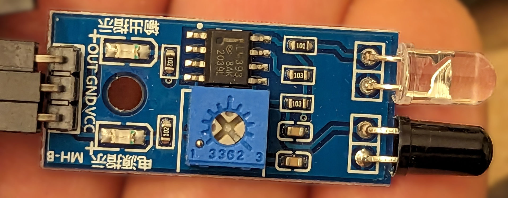

# Infrared Proximity Sensors

An infrared (IR) proximity sensor uses an infrared emitter and an infrared
detector to determine whether an object is close to the sensor.  Depending
on the specific sensor, the range may be as low as 2cm (0.8 inch) or as high
as 40 cm (16 inches).  Typically these sensors are somewhat directional, with
a 35-degree detection angle being representative.

# What does an IR proximity sensor look like?

Here's one type of IR proximity sensor that we use, the MH-B Flying Fish:

# How do IR proximity sensors work?

In the picture above, you can see two bumps (one white and one black) at the
end of the sensor.  One of the two bumps on the end emits infrared light.  The
other bump detects infrared light when it bounces off a nearby target.

# How do I wire an IR proximity sensor?

The MH-B sensor has its pins conveniently marked on the circuit board.
Choose a Digital I/O on the roboRIO.  Then simply connect that Digital I/O's
signal pin to the sensor pin marked OUT; connect the Digital I/O's ground pin
to the sensor pin marked GND; connect the Digital I/O's +5V pin to the sensor
pin marked VCC; and your wiring is complete!

If your wiring is correct and the roboRIO is powered, at least one green LED
should light up on the sensor.

# How do I calibrate the sensor?

If you see one light on the sensor, it is *not* detecting anything nearby.  If
you see two lights, the sensor *is* detecting something nearby.  However,
for the MH-B, "nearby" can mean anywhere from under an inch to 12 inches.

The MH-B has a plastic calibration screw.  This screw can be turned to adjust
the distance at which objects are detected.  Wire up the sensor, turn on the
power, and hold an object at the threshold distance from the sensor.  Turn the
screw until the LEDs indicate that the sensor has changed from detecting to
not-detecting (or vice versa).  This indicates that the sensor range has been
adjusted to your testing distance.

# What are part numbers for IR proximity sensors we use?

We've qualified the following IR proximity sensors:

* HiLetgo MH-B [[data sheet](https://5.imimg.com/data5/YT/KV/MY-1833510/arduino-ir-infrared-obstacle-avoidance-sensor-module.pdf)] [[vendor link](https://www.amazon.com/dp/B07W97H2WS)]
