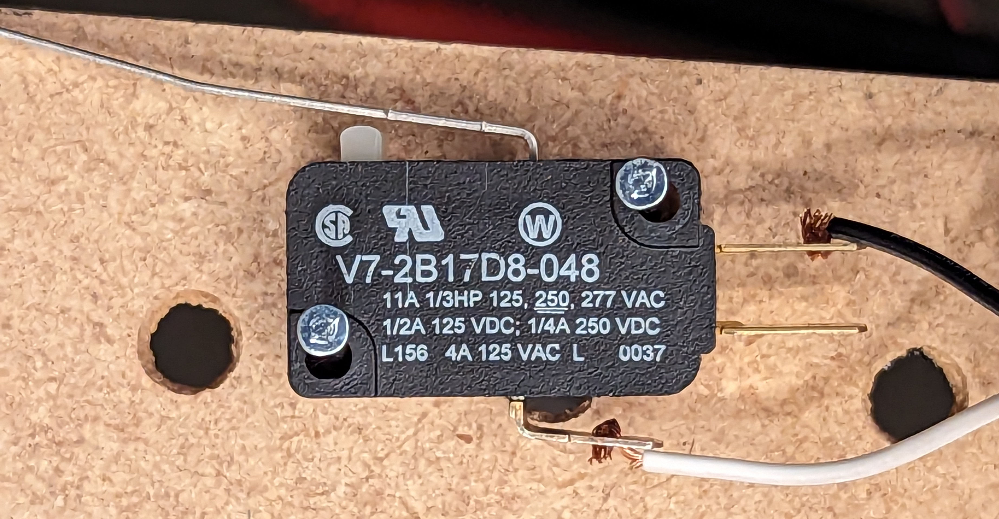
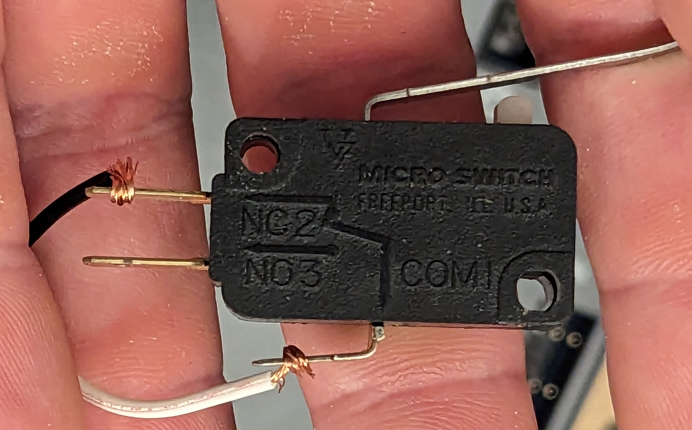
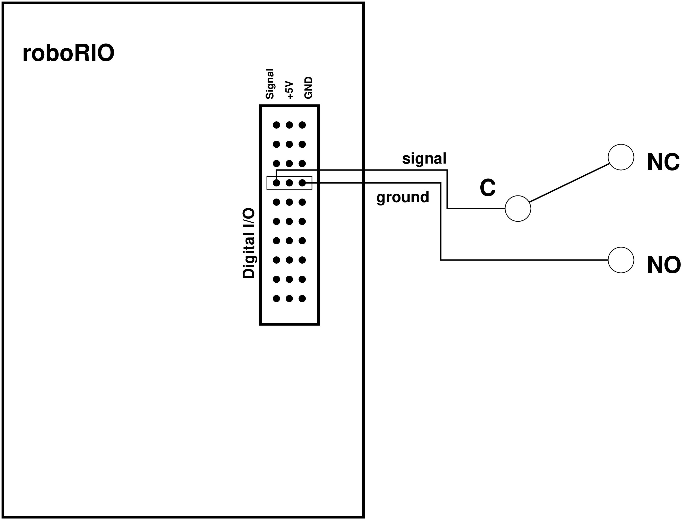
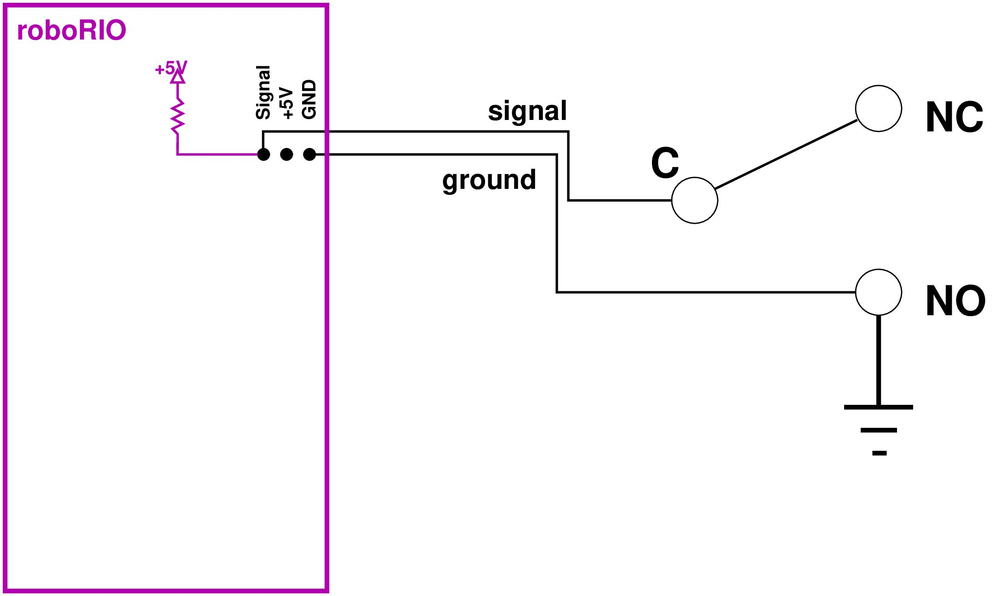

# Limit Switches

A limit switch is a simple mechanical switch that determines whether it has
been bumped into.

Limit switches are typically used to determine whether a component of the robot
(for example, a turret or an elevator) has reached the end of its range of
motion.  We then want to write code to stop the motor from driving the
component further in that direction.  However, we must be careful to allow
the motor to still move the component in the opposite direction (away from
the limit switch).

Some motor controllers allow you to connect limit switches directly to the
motor controller, with no need to write our own code.

# What does a limit switch look like?

A limit switch looks like this:

The long metal bar triggers the switch.  This makes it easy to trigger the
switch by having a robot component bump into it.  (We want to be sure that the
switch doesn't get bumped with so much energy that the switch breaks, of
course!)

# How do limit switches work?

A limit switch is a mechanical *momentary* switch.  This means that it is
normally in one position, but you can push it into the other position.
However, once you stop pushing, the switch reverts to its normal position.

A limit switch is a mechanical *1-pole 2-throw switch*.  This means that it
can electrically connect one side of the switch to either of two contacts on
the other side of the switch.

Think about a light switch.  It can either connect the power or not, but it
can't send the power somewhere else.  This is a *1-pole 1-throw* switch.

Maybe you've seen an "A/B switch" somewhere.  A/B switches let you choose
between 2 sets of speakers for your music to play out of, or between 2
screens for your video to appear on, etc.  They allow a signal to go either
to destination A or to destination B.  (Or they allow input to come either
from source A or from source B.)  These are *2-throw* switches.  (We can't
say how many poles, or individual wires, they have without looking at the
specific switch.)  If you had an A/B/C switch, it would be a *3-throw*
switch.

A momentary 2-throw switch typically labels its contacts as "common" (the
side which is always connected and which will be connected to one of the
other two contacts), "normally closed" (the contact which is connected
when the switch isn't being used), and "normally open" (the contact which
is *disconnected* when the switch isn't being used).  When the switch is
used, the "normally closed" contact becomes open (disconnected), and the
"normally open" contact becomes closed.

Since a limit switch is a 1-pole 2-throw switch, we can use it to choose
which of 2 signals will go to our roboRIO.  We'll use one signal to indicate
that the switch is *not* active, and the other signal to indicate that it
*is* active.  Since this is a digital signal, we'll use a logical 1 (+5V or
+3.3V) for one signal, and a logical 0 (0V) for the other.  We could choose
either way -- a logical 1 could mean either "we're NOT at the limit" or
"we ARE at the limit" -- as long as the electrical team and programming team
agree on which means what!  However, choosing a logical 1 to mean "we're NOT
at the limit" saves a little power.

# How do I wire a limit switch?

Since a limit switch is a momentary 2-throw switch, it has three contacts
labeled "C" (or "COM") for "common", "NO" for "normally open", and "NC"
for "normally closed".  We're going to wire our limit switch like this:

The signal wire connects the common terminal of the switch to the Signal input
of whichever roboRIO Digital I/O you choose.  The ground wire connects the
ground pin of that Digital I/O to the normally-open contact of the switch.
_*The normally-closed contact of the switch remains unconnected.*_
This is equivalent to the following circuit diagram:

When the limit switch is active, the common and normally-open
terminals are connected.  This means that the common terminal will be
driven to 0V, which the roboRIO's digital I/O pin will interpret as a
digital 0, and the software can read that as a logical "false" signal:
The motor should *NOT* be driven farther.  (If you name your variable
something with the opposite logical sense, such as "limitSwitchIsActive",
make sure to assign it the logical negation of the value on the roboRIO's
digital I/O pin!)

However, you may be wondering how we get a logical 1 to the digital I/O pin
when the limit switch is *not* active.  After all, the normally-closed
terminal of the switch isn't connected to anything, so it can't drive the
digital I/O pin to +5V (or +3.3V).  The answer is that the roboRIO is
built with pull-up resistors on each of its digital I/O pins, so the
actual circuit diagram looks like this:

(Note the pull-up resistor in purple, internal to the roboRIO.)
There is no complete circuit, so current doesn't flow, but the power supply
"pulls up" the voltage on the "Signal" digital input to a logical 1.  (In
spite of its name, the pull-up resistor isn't responsible for pulling up the
voltage.  Its job is to limit the current to a reasonable amount when the pin
is connected to ground.)

# What are part numbers for limit switches we use?

We've qualified the following limit switches:

* Honeywell V7-2B17D8-048 [[data sheet](https://www.alliedelec.com/m/d/b4e08726bf294639cfd9b226c34e8f08.pdf)] [[vendor link](https://www.alliedelec.com/product/honeywell/v7-2b17d8-048/70120164/)]
