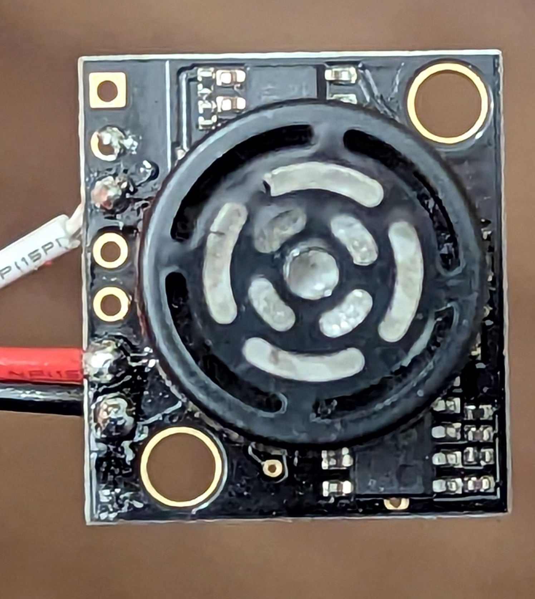

# Ultrasonic Range Sensor

An ultrasonic range sensor uses ultrasonic sound frequencies (too high-pitched
for humans to hear) to determine the distance to the nearest object in a
straight line outward from the emitter.  They have a minimum and maximum range,
which varies depending on the model of the sensor.

# What does an ultrasonic range sensor look like?

Here's one type of ultrasonic sensor that we use:



# How do ultrasonic sensors work?

The cylinder in the picture above emits a very high-pitched sound, around
40 kHz.  (Humans can hear up to roughly 20 kHz.)  This sound travels straight
out of the emitter until it hits an object, and then it bounces back.  The
sensor determines the distance based on the time it takes the sound to travel
out and back.

# How do I wire an ultrasonic sensor?

Ultrasonic sensors are analog sensors.  Instead of outputting a logical 0 (0V)
or a logical 1 (+5V), they output a voltage anywhere between the two.  By
plugging that output into one of the roboRIO's Analog I/O ports, we can have
the roboRIO convert that voltage to a number between 0 and 4095.  (0V = 0,
0.00122V = 1, 0.00244V = 2, ... 2.5V = 2048, ... 5V = 4095.)  This assumes
that the power supply is exactly 5.000 volts, which is usually not exactly
correct -- see below to see how to compensate for power supply voltage.

# How do I calibrate the sensor?

In the case of the Maxbotix MB1043 (and probably many other ultrasonic
sensors), the sensor's output voltage at a given range depends on the power
supply.  If the power supply voltage sags, the output signal will sag, even
at exactly the same range.

We can compensate for this by calculating a voltage scaling factor, as
Maxbotix recommends.  The MB1043 outputs its maximum voltage (VCC, nominally
+5V) at a range of 5.12 meters or 5120 mm.  If the power supply is at 4.8V,
the roboRIO will still work fine, but now a 4.8V output from the ultrasonic
sensor means 5.12 meters.

However, if we measure VCC, then we know that the number of volts representing
1 meter is VCC / 5.12 -- or the number of volts representing 1 mm is VCC / 5120,
or the number of volts representing 1 inch is VCC / (512/2.54).  An output of
VCC represents the maximum range (5.12 meters, or 5120 mm, or (512/2.54) inches,
etc.), and the scale is linear.

We can get the value of VCC from WPILib's RobotController class, using the
getVoltage5V() method.  Using that to compute the voltage scaling factor, we
can turn the ultrasonic sensor's output into a distance measurement, accounting
for the power supply voltage correctly:
```
  Distance in meters = (sensor output / VCC) * 5.12
  Distance in millimeters = (sensor output / VCC) * 5120
  Distance in inches = (sensor output / VCC) * (512 / 2.54)
```

# What are part numbers for ultrasonic sensors we use?

We've qualified the following ultrasonic sensors:

* Maxbotix MB1043 (range 30cm - 5m, or ~12in - 16.4 ft) [[data sheet](https://www.maxbotix.com/documents/HRLV-MaxSonar-EZ_Datasheet.pdf)] [[vendor link](https://www.maxbotix.com/ultrasonic_sensors/mb1043.htm)]
